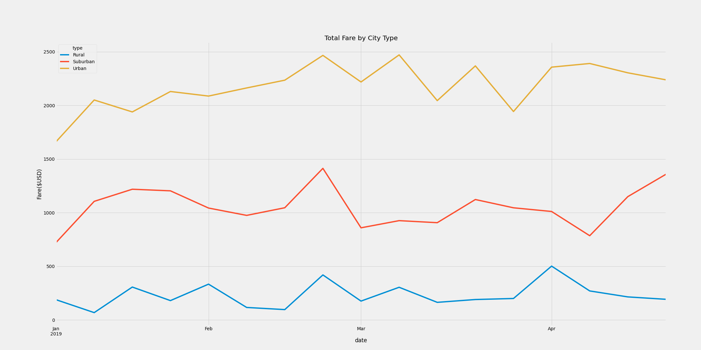

# PyBer_Analysis
In this module, we learned to create line, bar, scatter bubble, pie, and box & whisker plots with the assistance of Matplotlib. We also utilized the mean, median and mode features within Pandas and NumPy.

## Overview of the Analysis
After compiling the PyBer data and filtering through city type, total drivers, fare amount and total number of rides, we were asked to narrow the data to total weekly fares by each city type. The task was seperated into two assignments; Deliverable 1 and Deliverable 2:

* Deliverable 1: A ride-sharing summary DataFrame by city type
* Deliverable 2: A multiple-line chart of total fares for each city type

## Results

### After reviewing the data we can conclude the following:

#### 1. Urban Cities
* Urban cities started at the highest amount in January with roughly $1700
* Urban cities ended May with roughly $2250, higher than all others including its own starting amount in January.

#### 2. Suburban Cities
* Suburban cities experienced a fluxuation of spikes and drops
* In January, suburban cities started at roughly $750
* By May, suburban cities peaked at its highest amount of roughly $1,375

#### 3. Rural Cities
* Rural cities experienced consistant increases and decreases in the total fares, never surpasing the $500 mark
* In January, rural cities started at roughly $250
* By May, rural cities ended at roughly the same amount in total fares they started with in January.

## Summary

1. Successful Urban Business

* Urban areas, by default, have always relied on other modes of transportation than their own. This is because Urban areas tend to lack parking. That being said, continuing to offer PyBer services in Urban areas will continue to yield higher favorable numbers naturally.

2. Lack of drivers in Suburban and Rural areas

* Subruban and Rural areas have a limited amount of drivers in comparison to Urban cities. This goes back to urban cities relying on other modes of transportation than their own. However, Suburban and Rural cities can also benefit from using Pyber's resources. Investing in the increase of drivers in the suburban and rural cities could have a positive result.

3. Develop a more reasonable fare price in rural areas

* From the bubble chart, we can see that the price in U.S. Dollars for fares in Rural areas are roughly 1.5 times more expensive than those in urbn areas. This could also have something to do with the low use of Pyber. It could be in PyBer's best interest to level the fare across the board for all users.
